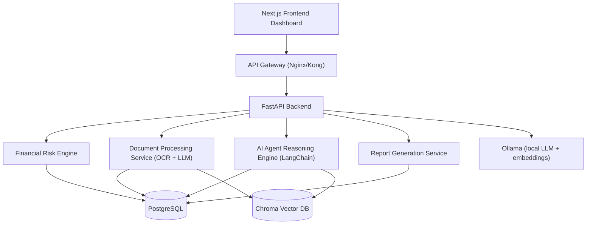

# UnderwriteAI Architecture

## System Diagram

## Backend Service Boundaries

- `app/services/risk_engine.py`: deterministic financial metric computation.
- `app/services/document_intelligence.py`: OCR + LLM extraction pipeline.
- `app/agents/orchestrator.py`: multi-agent LangChain workflow.
- `app/services/report_generation.py`: PDF report builder.
- `app/rag/vector_store.py`: Chroma storage/retrieval for context.

## Data Model

Required core tables are implemented:

- `users`
- `borrower_profiles`
- `documents`
- `financial_metrics`
- `loan_decisions`
- `simulation_scenarios`

## Security and Production Notes

- No paid model API keys are required for local LLM mode.
- Restrict backend network access so only trusted clients can reach the API.
- Put TLS termination and WAF in front of API gateway.
- Add row-level authorization before multi-tenant rollout.
- Move from `create_all` startup to Alembic migrations for production change control.
